This is a [Next.js](https://nextjs.org) project bootstrapped with [`create-next-app`](https://nextjs.org/docs/app/api-reference/cli/create-next-app).

## Getting Started

First, run the development server:

```bash
npm run dev
# or
yarn dev
# or
pnpm dev
# or
bun dev
```

Open [http://localhost:3000](http://localhost:3000) with your browser to see the result.

You can start editing the page by modifying `app/page.tsx`. The page auto-updates as you edit the file.

This project uses [`next/font`](https://nextjs.org/docs/app/building-your-application/optimizing/fonts) to automatically optimize and load [Geist](https://vercel.com/font), a new font family for Vercel.

## Learn More

To learn more about Next.js, take a look at the following resources:

- [Next.js Documentation](https://nextjs.org/docs) - learn about Next.js features and API.
- [Learn Next.js](https://nextjs.org/learn) - an interactive Next.js tutorial.

You can check out [the Next.js GitHub repository](https://github.com/vercel/next.js) - your feedback and contributions are welcome!

## Deploy on Vercel

The easiest way to deploy your Next.js app is to use the [Vercel Platform](https://vercel.com/new?utm_medium=default-template&filter=next.js&utm_source=create-next-app&utm_campaign=create-next-app-readme) from the creators of Next.js.

Check out our [Next.js deployment documentation](https://nextjs.org/docs/app/building-your-application/deploying) for more details.

---

<br>

# Laporan Praktikum

|       | Pemrograman Berbasis Framework 2025 |
| ----- | ----------------------------------- |
| NIM   | 2241720053                          |
| Nama  | M. Tryo Bagus Anugerah Putra        |
| Kelas | TI - 3C                             |

## Praktikum 1: Menyiapkan Lingkungan Pengembangan

## Pertanyaan Praktikum 1

### 1. Jelaskan kegunaan masing-masing dari Git, VS Code dan NodeJS yang telah Anda install pada sesi praktikum ini!

> - Git adalah sistem kontrol versi (Version Control System) yang digunakan untuk melacak perubahan dalam kode sumber selama pengembangan perangkat lunak.
> - VS Code (Visual Studio Code) adalah text editor yang dikembangkan oleh Microsoft dengan berbagai fitur canggih untuk pengembangan perangkat lunak.
> - Node.js adalah runtime JavaScript berbasis V8 Engine yang memungkinkan eksekusi JavaScript di luar browser.

### 2. Buktikan dengan screenshoot yang menunjukkan bahwa masing-masing tools tersebut telah berhasil terinstall di perangkat Anda!

- Instalasi Git
  > 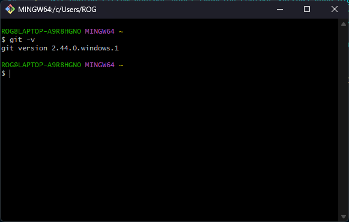
- Instalasi VS Code
  > 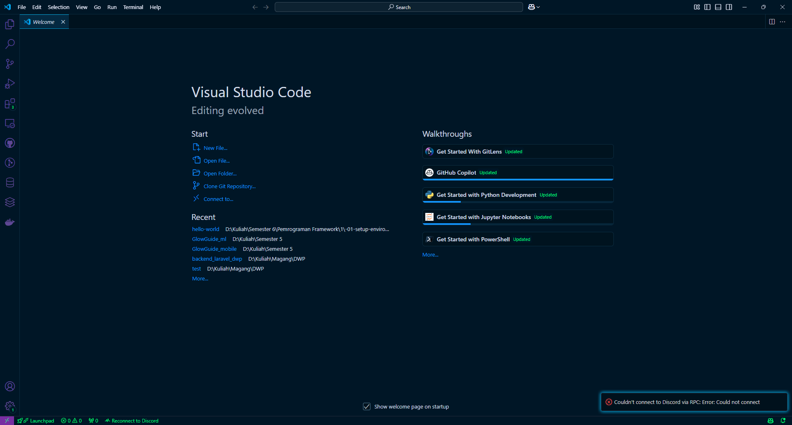
- Instalasi NodeJS
  > 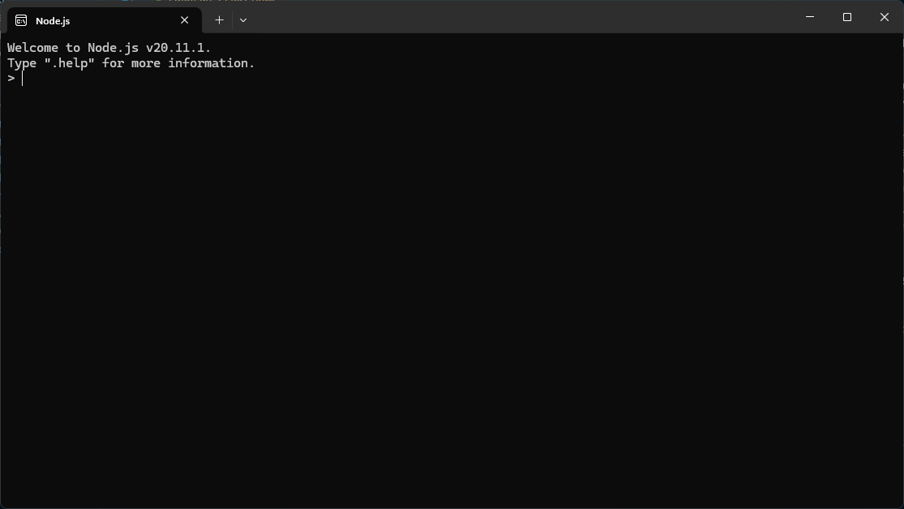

## Praktikum 2: Membuat Proyek Pertama React Menggunakan Next.js

1. Membuat folder proyek baru dengan nama `belajar-react`. Melalui konsol/command
   prompt/CMD masuk ke dalam folder tersebut dan jalankan perintah ini:
   npx `create-next-app`.

2. Buat proyek baru dengan nama hello-world seperti di bawah ini. Nama proyek ini perlu dimasukkan pertama kali melalui konsol. 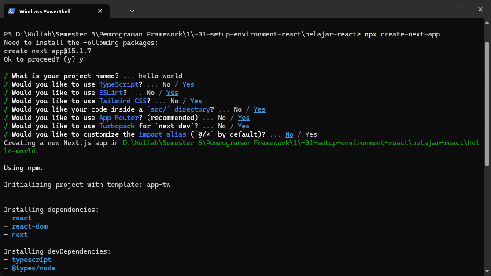

3. Buka folder proyek hello-world menggunakan VS Code. Masuk ke dalam folder proyek helloworld dengan perintah: <br>
   `cd hello-world`<br>
   Kemudian setelah masuk ke folder hello-world, masukkan perintah: <br>
   `code .` <br>
   Maka VS Code akan membuka project react Anda yang telah dibuat bernama hello-world.
   Dan akan menampilkan struktur folder proyek seperti di bawah ini.
   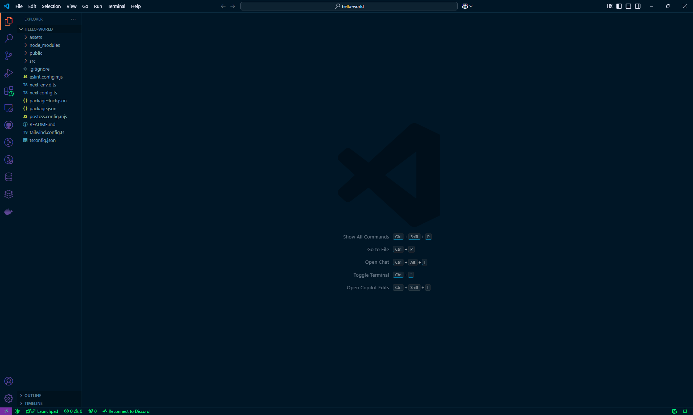

4. Running proyek hello-world dengan memasukkan perintah di bawah ini melalui konsol atau terminal di dalam VS Code. <br>
   `npm run dev` <br>
   Tunggu proses kompilasi hingga selesai. Lalu Anda dapat membuka alamat localhost di
   browser: http://localhost:3000/
   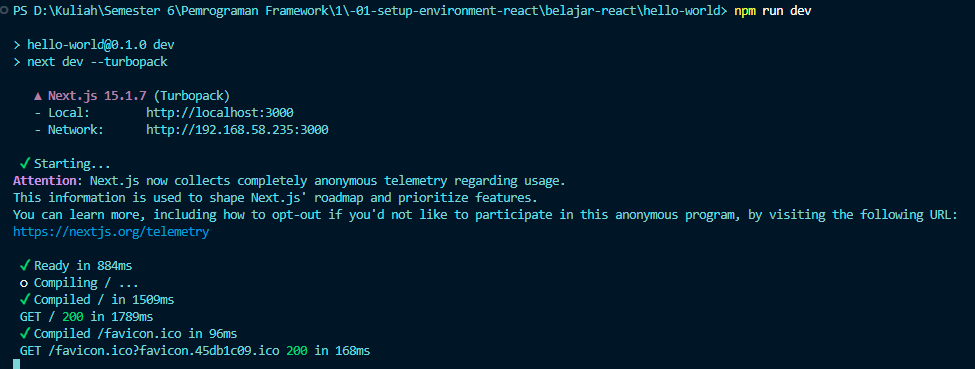
   Jika di browser telah tampil seperti gambar berikut ini, Selamat!
   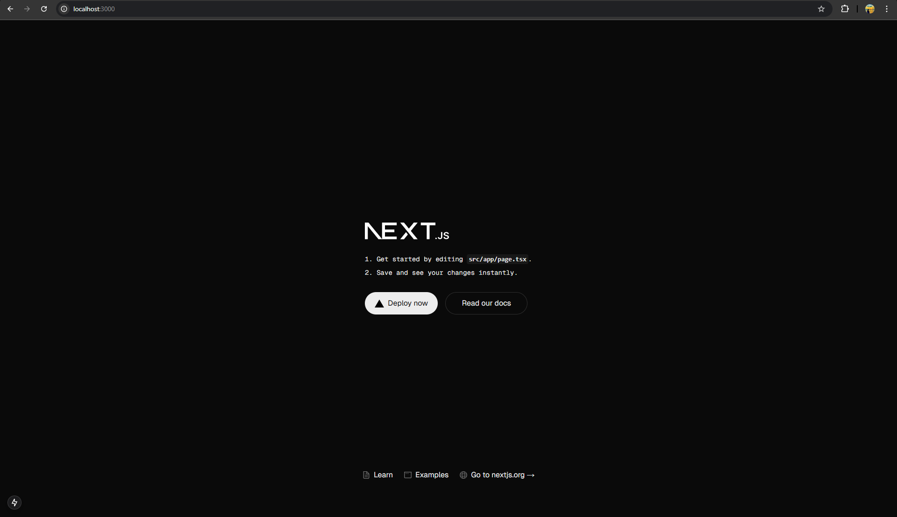

## Pertanyaan Praktikum 2

### 1. Pada Langkah ke-2, setelah membuat proyek baru menggunakan Next.js, terdapat beberapa istilah yang muncul. Jelaskan istilah tersebut, TypeScript, ESLint, Tailwind CSS, App Router, Import alias, App router, dan Turbopack!

> - `TypeScript` adalah Superset dari JavaScript yang menambahkan `static typing`, membantu mendeteksi kesalahan sejak awal, meningkatkan keterbacaan kode, dan membuat pengembangan lebih terstruktur serta aman.
> - `ESLint` adalah alat linter yang memastikan kode tetap rapih, konsisten, dan bebas dari kesalahan umum dengan menerapkan aturan kode yang dapat dikonfigurasi sesuai standar proyek.
> - `Tailwind CSS` adalah Framework CSS berbasis `utility-first` yang memungkinkan pengembang menulis styling langsung di dalam HTML atau JSX tanpa harus membuat file CSS terpisah, sehingga meningkatkan kecepatan pengembangan.
> - `App Router` adalah Sistem routing terbaru di Next.js yang menggunakan server components secara default, memungkinkan pengelolaan halaman, layout, loading, dan error handling dengan cara yang lebih modular dan efisien dibandingkan sistem Pages Router lama.
> - `Import Alias` adalah Fitur yang memungkinkan penggunaan jalur import yang lebih sederhana dengan alias, sehingga mempermudah navigasi kode dan menghindari penggunaan relative path yang panjang dan sulit dibaca.
> - `Turbopack` adalah Bundler generasi terbaru berbasis Rust, yang dirancang untuk menggantikan Webpack dalam pengembangan lokal, memberikan kompilasi dan hot module replacement (HMR) yang jauh lebih cepat, sehingga meningkatkan produktivitas pengembang.

### 2. Apa saja kegunaan folder dan file yang ada pada struktur proyek React yang tampil pada gambar pada tahap percobaan ke-3!

> - `.next/` Folder ini berisi hasil build, cache, dan output kompilasi dari Next.js. Folder ini dibuat secara otomatis saat menjalankan proyek dan tidak perlu diubah secara manual. Biasanya, folder ini ditambahkan ke `.gitignore` agar tidak ikut dikirim ke repository.
> - `node_modules/` Berisi semua package dan library yang diinstal melalui npm atau yarn. Folder ini menyimpan dependensi yang dibutuhkan oleh proyek agar dapat berjalan dengan baik. Karena ukurannya bisa besar, folder ini juga tidak disertakan dalam repository Git.
> - `public/` Folder untuk menyimpan file statis seperti gambar, ikon, dan font. File di dalam folder ini bisa diakses langsung melalui URL tanpa perlu di-import dalam kode. Contohnya, jika ada `logo.png` di dalam folder `public/`, maka bisa diakses melalui `/logo.png`.
> - `src/app/` Folder ini digunakan untuk mengelola halaman aplikasi dan komponen routing. Setiap subfolder dalam `app/` akan otomatis menjadi route, misalnya folder `about/` dengan file `page.tsx` akan menjadi halaman `/about`. <br> > **File penting dalam src/app/:** <br>
    - `favicon.ico` → Ikon kecil yang ditampilkan di tab browser. Biasanya ditempatkan di folder `public/` agar dapat digunakan secara otomatis oleh browser. <br>
    - globals.css → File CSS global yang berisi styling yang diterapkan di seluruh halaman dalam proyek. Biasanya digunakan untuk mendefinisikan style dasar seperti warna tema, font, dan reset CSS. <br>
    - layout.tsx → Komponen utama yang berfungsi sebagai layout global untuk aplikasi. Layout ini biasanya digunakan untuk menyertakan elemen yang konsisten di setiap halaman, seperti navbar dan footer. <br>
    - page.tsx → Komponen yang digunakan untuk membuat halaman utama dari aplikasi, yaitu halaman yang ditampilkan saat pengguna mengakses root URL `/`.
> - `.gitignore` File yang menentukan file dan folder apa saja yang harus diabaikan oleh Git. Biasanya, `node_modules/`, `.next/`, dan file konfigurasi sensitif seperti `.env` akan dimasukkan ke dalam `.gitignore` agar tidak ikut dikirim ke repository.
> - `eslint.config.mjs` File konfigurasi untuk ESLint, alat yang membantu menjaga kualitas kode dengan memberikan peringatan atau error ketika ada kesalahan dalam sintaks atau style kode.
> - `next-env.d.ts` File otomatis yang dibuat oleh Next.js saat menggunakan TypeScript. File ini membantu dalam mengenali tipe data dan mengoptimalkan pengalaman pengembangan dengan TypeScript.
> - `next.config.ts` File konfigurasi utama untuk Next.js yang memungkinkan pengaturan khusus seperti optimasi gambar, redirects, rewrites, dan environment variables.
> - `package-lock.json` File yang berisi daftar versi spesifik dari semua package yang diinstal dalam proyek. File ini memastikan bahwa setiap instalasi proyek memiliki dependensi yang sama, sehingga menghindari konflik versi di lingkungan yang berbeda.
> - `package.json` File yang menyimpan informasi dasar tentang proyek, seperti nama proyek, versi, dependensi, dan skrip yang digunakan untuk menjalankan proyek.
> - `postcss.config.mjs` File konfigurasi untuk PostCSS, alat yang membantu dalam memproses CSS, sering digunakan bersama Tailwind CSS untuk optimasi styling.
> - `README.md` File dokumentasi proyek yang biasanya berisi informasi tentang cara menginstal, menjalankan, dan menggunakan aplikasi. Berguna bagi developer lain yang ingin memahami proyek ini.
> - `tailwind.config.ts` File konfigurasi untuk Tailwind CSS, digunakan untuk menyesuaikan warna, font, breakpoints, dan utility lainnya dalam proyek.
> - `tsconfig.json` File konfigurasi TypeScript yang menentukan bagaimana TypeScript akan dikompilasi. File ini berisi aturan seperti strict mode, path alias, dan tipe data yang diperbolehkan dalam proyek.

### 3. Buktikan dengan screenshoot yang menunjukkan bahwa tahapan percobaan di atas telah berhasil Anda lakukan!

> 

## Praktikum 3: Menambahkan Komponen React (Button)

1. Di dalam folder proyek yang telah dibuka di VS Code, buka file page.tsx
2. Tambahkan fungsi MyButton yang mengembalikan markup komponen button yang akan ditambahkan ke dalam webpage<br> 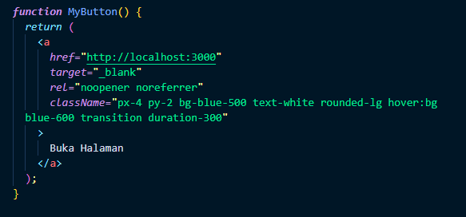
3. Tambahkan komponen button tersebut di samping button Read Our Docs.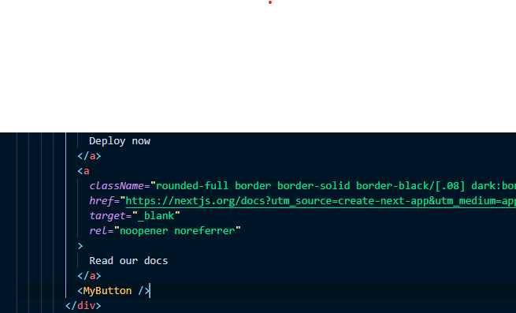
   Perhatikan bahwa komponen MyButton dimulai dengan huruf kapital. Dengan cara itulah
   Anda mengetahui bahwa itu adalah sebuah komponen React. Nama komponen React harus
   selalu dimulai dengan huruf kapital, sedangkan tag HTML harus menggunakan huruf kecil.
   Kata kunci export default menentukan komponen utama di dalam berkas (file).
4. Simpan perubahan dan coba lihat perubahan melalui web browser!
   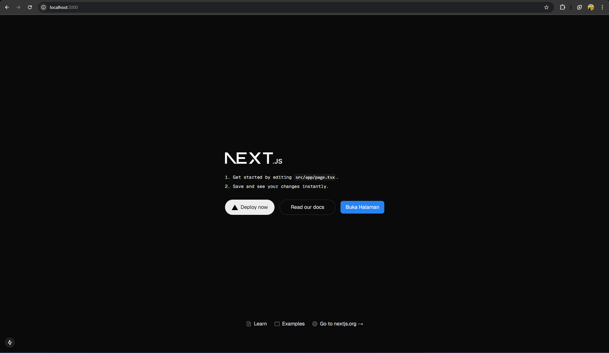

## Pertanyaan Praktikum 3

### 1. Buktikan dengan screenshoot yang menunjukkan bahwa tahapan percobaan di atas telah berhasil Anda lakukan!

> 

## Praktikum 4: Menulis Markup dengan JSX

1. Tambahkan kode JSX di bawah ini ke dalam file page.tsx.
   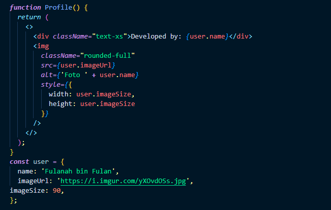
2. Tambahkan komponen MyProfile setelah kompnen MyButton.
   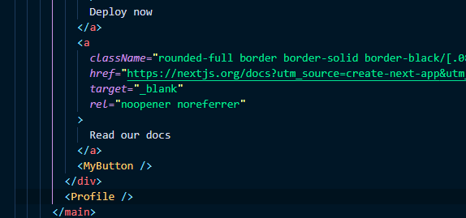
3. Simpan dan amati perubahan di halaman web yang dihasilkan!
   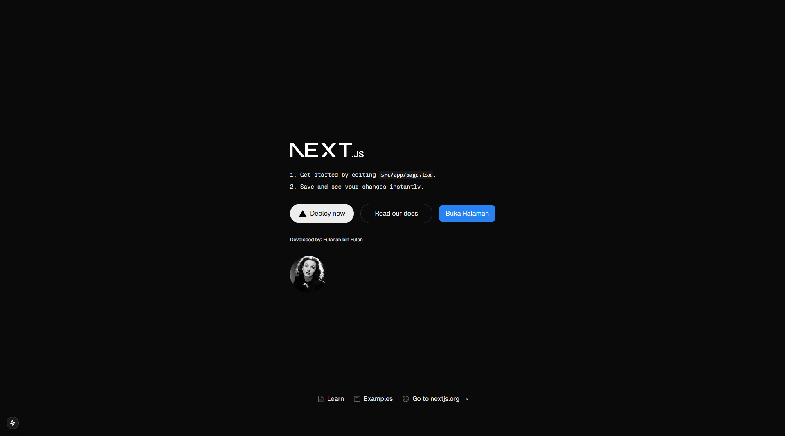

## Pertanyaan Praktikum 4

### 1. Untuk apakah kegunaan sintaks `user.imageUrl`?

> Sintaks `user.imageUrl` digunakan untuk mengakses URL gambar profil dari objek `user`. Ini sering digunakan dalam aplikasi untuk menampilkan gambar pengguna secara dinamis, misalnya dalam elemen ``. Jika `imageUrl` berasal dari database atau API, tampilan bisa berubah sesuai data pengguna. Untuk menghindari error saat nilainya `null` atau `undefined`, biasanya diberikan nilai default seperti `"default-profile.png"`.

### 2. Buktikan dengan screenshoot yang menunjukkan bahwa tahapan percobaan di atas telah berhasil Anda lakukan!

> 
